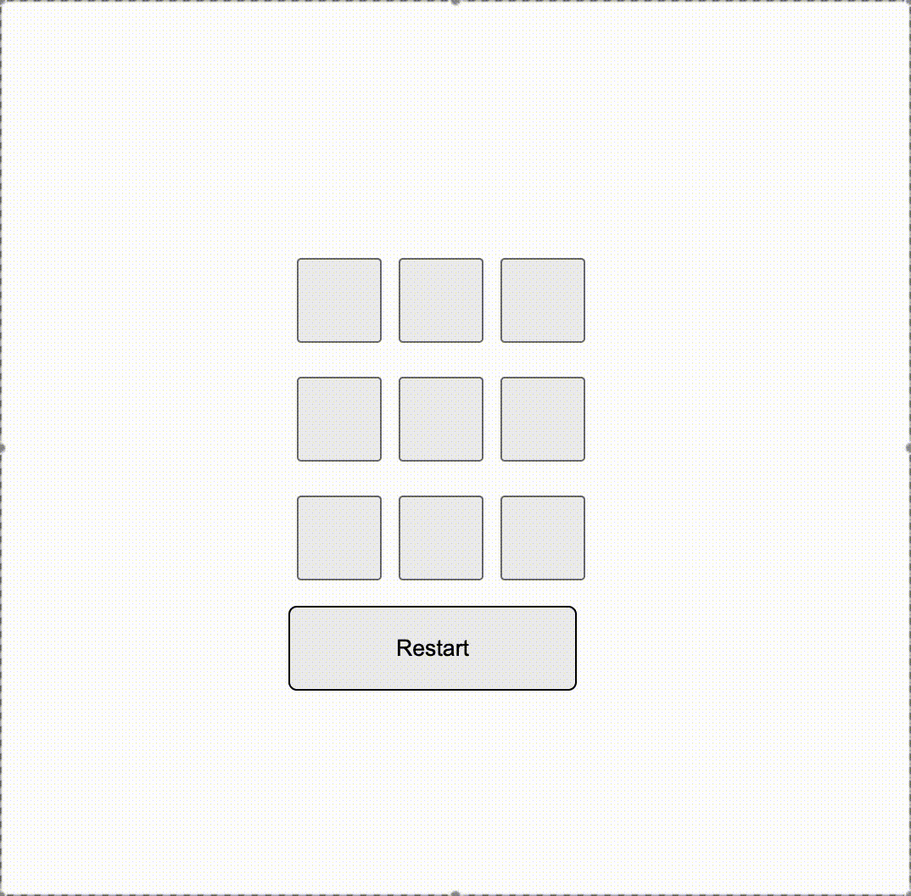

# ❎0️⃣ my-tic-tac-toe

Простая игра крестики нолики, супер базовая, для игры с самим собой либо для игры с другом на одном устройстве. 

v2.0.0
---

# 💻 Демонстрация

---

# 🛠️ Технологии

  
  
  
  
  

---

# 🔮 Будущее

Начал работу с ботом 

Планирую добавить так же бота чтобы играть если нет друга, а так же сделать отдельную версию в которую можно будет играть по сети